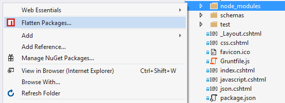
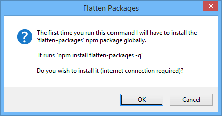
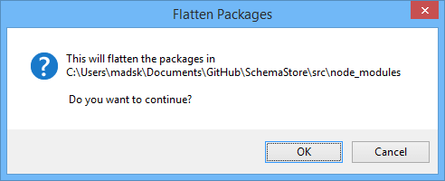

## Flatten Packages for Visual Studio

Flattens `node-modules` folder to avoid long path issues on Windows.

Download this extension from the [VS Gallery](https://visualstudiogallery.msdn.microsoft.com/cd0b1938-4513-4e57-b9b7-c674b4a20e79)
or get the [nightly build](http://vsixgallery.com/extension/a7dff10f-3592-429c-9dc1-622fe517921d/).

### Features

The extension adds a button in the context-menu of Solution Explorer.

It shows up when you right-click `package.json` or any folder containing
a subfolder called `node_modules`.

The first time you run this extension it will download the npm package
[flatten-packages](https://www.npmjs.com/package/flatten-packages) if
you don't already have it installed.

When the flatten-packages modules is installed (it takes ~5 seconds),
the extension will run the command to flatten the package hierarchy
in the `node_modules` folder.

Since the extension uses a Node module behind the scenes, the package
flattening will work with long paths that Windows and Visual Studio 
normally can't handle.